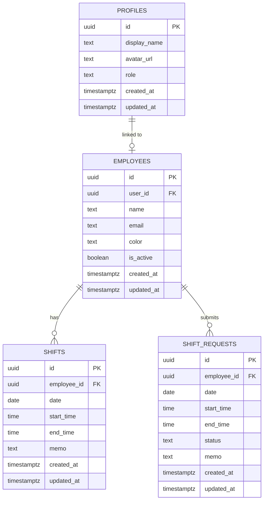

# time-sc (シフト管理サービス)

バイトや従業員のシフト希望の管理から、確定シフトの作成・編集までを一元管理できるWebアプリケーションです。

---

## 🚀 主要機能

### 1. 認証とセキュリティ (Google OAuth)
- **Googleログイン**: Supabase Authを使用したGoogleアカウントによるセキュアなサインイン。
- **認証ガード (Middleware)**: 未ログインのユーザーをトップページへ自動リダイレクトし、ログイン済みのユーザーは自動的にダッシュボードへ遷移させます。

### 2. ダッシュボード
- 当日の稼働シフト数、アクティブな従業員数、未承認のシフト希望数をサマリーカードで一目で把握できます。

### 3. 従業員管理 (CRUD)
- 従業員の新規登録、名前・メールアドレスの編集、削除（論理削除可）。
- 各従業員に固有のカラーを設定でき、カレンダー上での色分け表示に反映されます。
- 有効/無効状態の切り替え機能。

### 4. シフトカレンダー (月ビュー / 週ビュー)
- **月ビュー**: 月間カレンダー上に割り当てられたシフトを従業員カラーのバッジで表示。
- **週ビュー**: 6:00〜21:00の時間軸を持った一週間のタイムテーブル表示。
- **複数人一括登録機能**: 
  - 新規にシフトを追加する際、従業員をチェックボックスで複数選択し、同じ日付・時間帯に一括でシフトを登録（バルクインサート）できます。
  - 「すべて選択」「選択解除」の補助機能付き。
- **個別編集**: カレンダー上のシフトをクリックすることで、個別に時間やメモを編集・削除できます。

### 5. シフト希望管理
- 従業員からのシフト希望一覧。
- 店長・マネージャーによる「承認」「却下」のワンクリック操作。
- **承認時の自動反映**: シフト希望を「承認」すると、自動的に確定シフトテーブルにデータがコピーされ、カレンダー上に即座に表示されます。
- 管理者による希望の「代理入力」機能。

### 6. テーマ手動切り替え (ライト / ダークモード)
- ヘッダーの切り替えトグルボタンから、いつでもブラックモードとホワイトモードを切り替えられます。
- 選択されたテーマは `localStorage` に保存され、ページ遷移やリロードでも維持されます。
- **チラつき防止 (FOUC対策)**: SSR（サーバーサイドレンダリング）時に一瞬異なるテーマで描画されるのを防ぐため、HTMLの読み込み直後に優先実行される判定スクリプトを `<head>` 内に実装しています。

---

## 🛠️ 技術スタック

| 分類 | 技術 | 役割 |
| :--- | :--- | :--- |
| **コア** | Next.js 16 (App Router) | フロントエンド & サーバーサイドレンダリング |
| **言語** | TypeScript | 型安全性・開発効率の向上 |
| **スタイル** | TailwindCSS 4 | ユーティリティファーストのUI設計 |
| **データベース** | Supabase (PostgreSQL) | シフトデータ、従業員データの永続化 |
| **認証** | Supabase Auth (Google OAuth) | Googleアカウントによるシングルサインオン |
| **インフラ** | GitHub | バージョン管理・ソースコードの同期 |

---

## 📊 データベース設計

### テーブル構造

1. **profiles**: ログインユーザー（Supabase Authと連携するメタデータ）
2. **employees**: 従業員マスターテーブル（カラー、有効状態管理）
3. **shifts**: 確定した勤務シフトデータ
4. **shift_requests**: 従業員からの提出希望シフトデータ

### ER図



---

## ⚙️ セットアップ & 起動手順

### 1. 環境変数の設定
ローカル環境に `.env.local` ファイルを作成し、ご自身のSupabaseプロジェクトのキーを設定します。

```env
NEXT_PUBLIC_SUPABASE_URL=https://<your-project-id>.supabase.co
NEXT_PUBLIC_SUPABASE_ANON_KEY=<your-anon-key>
```

### 2. データベースの初期設定
Supabase ダッシュボードの「SQL Editor」を開き、リポジトリ内にある `supabase-schema.sql` の内容をコピー＆ペーストして実行してください。
テーブル定義、インデックス、およびRLS（行レベルセキュリティ）ポリシーが作成されます。

### 3. Google OAuth の設定
1. Google Cloud Console で OAuth クライアントID（ウェブアプリケーション）を作成します。
2. 承認済みのリダイレクトURIに Supabase ダッシュボード（Authentication -> Providers -> Google）の「Callback URL」を設定します。
3. Supabase側に Google Client ID と Client Secret を入力して有効化します。

### 4. ローカル開発サーバーの起動
依存関係のインストール後、開発サーバーを起動します。

```bash
# 依存関係のインストール
npm install

# 開発サーバー起動
npm run dev
```

起動後、 [http://localhost:3000](http://localhost:3000) にアクセスします。

---

## 📈 開発プロセス (これまでの歩み)

プロジェクトは以下のマイルストーンに沿って段階的に実装を行いました。

* **Phase 1: 基盤セットアップ**
  * Next.js 16プロジェクトへの Supabase クライアント (`@supabase/supabase-js`, `@supabase/ssr`) の導入。
  * 認証保護のためのミドルウェア (`proxy.ts` - Next.js 16対応) の構築。
* **Phase 2: 認証の実装**
  * Google OAuthによるログインフローおよびリダイレクトの構築。
* **Phase 3: ダッシュボード & 共通UI**
  * サイドバーやヘッダーを含むレイアウト、サマリー統計機能の作成。
* **Phase 4: コア機能の実装**
  * 従業員管理（CRUD）、カレンダー（月/週ビュー）、シフト希望管理の基本機能開発。
* **Phase 5: デザインポリッシュ**
  * ユーザーのフィードバックに基づき、丸みを帯びたデザインから洗練されたシンプルなフラットデザイン（角丸の抑制）へ調整。
* **Phase 6: 追加機能 - 複数人一括登録**
  * カレンダー上から、同じ時間帯にチェックボックスで指定した複数の従業員を一挙に割り当てられる一括登録機能を実装。
* **Phase 7: 追加機能 - 手動テーマ切り替え**
  * ブラックモード（ダーク）とホワイトモード（ライト）を任意に切り替えられる機能の実装、およびSSR特有のチラつきを排除するロジックの実装。
* **Phase 8: ドキュメント化とGitHub同期**
  * 当ドキュメント (`README.md`) の整備およびGitHubへの反映。
